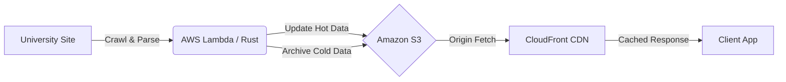

# Crawler

**Crawler** is a serverless, high-performance university announcement aggregator designed to provide a unified view of scattered campus notices.

Built with **Rust** and **AWS Serverless** architecture, it focuses on extreme cost efficiency and low-latency data delivery by leveraging a **Static Data Lake** pattern with smart caching strategies.

## Architecture

Crawler decouples data collection from data serving. The backend crawler runs periodically to update static JSON files on S3, which are then served globally via CloudFront.



## Storage Strategy: Hot & Cold Partitioning

To balance data freshness with retrieval efficiency, `Crawler` utilizes a dual-storage strategy.

### Directory Structure

```bash
storage/
├── config.toml           # Crawler configuration (e.g., target URLs, schedules)
├── seed.toml             # Seed data for initial crawl targets
├── siteMap.json          # Sitemap to be crawled by the crawler
├── current.json          # Latest active announcements (e.g., current month)
└── stacks/               # Immutable historical data
    ├── 2025/
    │   ├── 01.json       # Announcements from Jan 2025
    │   ├── ...
    │   └── 12.json       # Announcements from Dec 2025
    └── 2026/
        └── 01.json       # Announcements from Jan 2026
```

### 1. Hot Data (`current.json`)

* **Content:** Contains the most recent announcements (active semester/month).
* **Update Frequency:** High (triggered by crawler runs).
* **Caching Strategy:** **Stale-While-Revalidate (SWR)**.
* Clients receive a cached response instantly (low latency).
* CloudFront updates the cache in the background if the content is stale.
* *Header:* `Cache-Control: public, max-age=60, stale-while-revalidate=300`

### 2. Cold Data (`stacks/YYYY/MM.json`)

* **Content:** Historical metadata grouped by month.
* **Update Frequency:** Zero (Write-once, Read-many).
* **Caching Strategy:** **Immutable**.
* Once archived, these files never change, allowing for aggressive caching at the edge.
* *Header:* `Cache-Control: public, max-age=31536000, immutable`

## 📝 Data Schema

Since `Crawler` focuses on metadata, the payload is lightweight.

**Example: `current.json`**

```json
[
  {
    "id": "yonsei_ee_0001",
    "title": "공지사항 제목",
    "link": "https://ee.yonsei.ac.kr/",
    "metadata": {
      "campus": "신촌캠퍼스",
      "college": "공과대학",
      "department_name": "전기전자공학부",
      "board_name": "학사공지",
      "date": "2025-12-15",
      "pinned": false
    }
  },
  {
    "id": "yonsei_cais_0001",
    "title": "2026 Spring Semester Course Registration Guide",
    "link": "https://univ.edu/notice/12345",
    "metadata": {
      "campus": "신촌캠퍼스",
      "college": "인공지능융합대학",
      "department_name": "첨단융합공학부",
      "board_name": "취업정보",
      "date": "2026-01-31",
      "pinned": false
    }
  }
]
```

## 🚀 Tech Stack

* **Runtime:** Rust (optimized for AWS Lambda cold starts and memory usage).
* **Infrastructure:** AWS CDK / Terraform.
* **Compute:** AWS Lambda.
* **Storage:** Amazon S3.
* **CDN:** Amazon CloudFront.

## ⚡ Performance & Cost

* **Zero Database Cost:** Uses S3 as the primary database.
* **Minimized Requests:** Clients fetch `current.json` (1 request) to render the initial view, avoiding the "waterfall" request pattern of daily partitioned files.
* **Edge Caching:** 99% of read traffic is offloaded to CloudFront edge locations.
