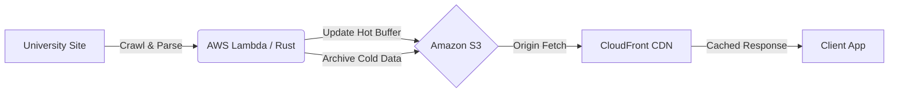
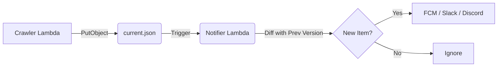

# Crawler

**Crawler** is a serverless, high-performance university announcement aggregator built to provide a unified, low-latency view of scattered campus notices.

Engineered with **Rust** on **AWS Lambda**, it leverages a **Static Data Lake** pattern with a strict **Hot/Cold data partitioning strategy**, achieving extreme cost efficiency and sub-millisecond data delivery.

## Core Architecture

`Crawler` operates on a "Write-Buffer / Read-Many" model. The backend periodically crawls target sites to update a static JSON buffer on `S3`, which is then archived and cached globally via `CloudFront`.



## Roadmap & Architecture Evolution

To enhance user experience and system reliability without compromising the "Serverless & Zero-DB" philosophy, the following architectural patterns are being implemented.

### Resilience: The "Circuit Breaker" Pattern

To prevent data corruption when university websites undergo structural changes or return empty responses, `Crawler` implements a strict **Sanity Check** before writing to `S3`.

* **Problem:** If the source site returns a blank page, a naive crawler would overwrite `current.json` with an empty list, causing a service outage for users.
* **Solution:**
  * **Threshold Guard:** If the number of crawled items drops by more than **20%** compared to the previous run, the write operation is aborted.
  * **Alerting:** An emergency alert is triggered instead of corrupting the live data.
  * **Result:** The system fails safe, preserving the last known good state.

### Event-Driven Notifications

`Crawler` decouples the "Crawling" logic from the "Notification" logic using AWS `S3` Event Notifications. This ensures that the heavy lifting of parsing does not block the alerting system.



* **Workflow:**

    1. The Crawler updates `current.json` on `S3`.
    2. `S3` emits an `ObjectCreated` event, triggering the **Notifier Lambda**.
    3. The Notifier calculates the **Diff** between the new and old versions.
    4. If new items are detected, push notifications are dispatched via `FCM`.

### Serverless Search (No-ES)

To enable full-text search without the cost of a dedicated search engine (like Elasticsearch), `Crawler` builds a static **Inverted Index**.

* **Mechanism:**
  * During the crawl, an **Inverted Index** (`index.json`) is generated, mapping keywords to Announcement IDs.
  * *Example:* `{"scholarship": ["id_001", "id_005"], "dorm": ["id_002"]}`

* **Client-Side Search:** The client fetches this lightweight index file to perform instant, offline-capable searches across the entire dataset.

## 💾 Storage Strategy: Hot & Cold Partitioning

### Directory Structure

```bash
storage/
├── config.toml           # Crawler Configuration
├── index.json            # HOT: Generated Inverted Index for Search
├── current.json          # HOT: Active Window (Write-Buffer)
├── siteMap.json          # COLD: Site Map for Crawling
└── stacks/               # COLD: Immutable Archives
    ├── 2025/
    │   ├── ...
    │   ├── 10.json       # Oct 2025 Archive
    │   ├── 11.json       # Nov 2025 Archive
    │   └── 12.json       # Dec 2025 Archive
    └── 2026/
        ├── 01.json       # Jan 2026 Archive
        └── 02.json       # Feb 2026 Archive
```

### Monthly Rotation Logic

1. **Hot Data (`current.json`):** Holds only the active window (e.g., last 60 days). It uses `stale-while-revalidate` caching for real-time updates.
2. **Cold Archive (`stacks/`):** At the start of each month, past data is snapshotted into immutable JSON files with long-term caching headers (`max-age=31536000`).

## Tech Stack

* **Runtime:** **Rust** (optimized for AWS Lambda cold starts).
* **Infrastructure:** AWS CDK.
* **Compute:** AWS Lambda.
* **Storage:** Amazon S3.
* **CDN:** Amazon CloudFront.

## Performance Metrics

* **Zero Database Cost:** S3 acts as the primary database.
* **O(1) Client Fetch:** Single request to render the main feed.
* **Resilience:** Circuit breakers prevent bad updates from reaching users.
